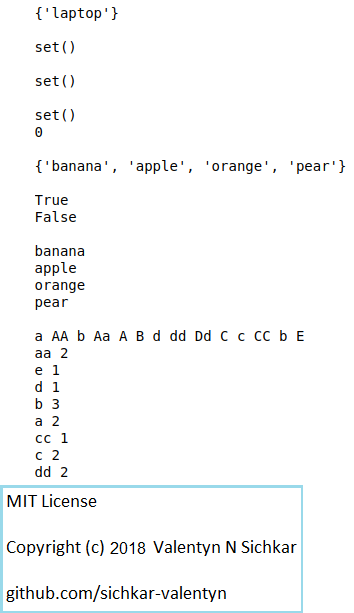

# Sets in Python
Creating and using Sets in Python

### Reference to:
[1] Valentyn N Sichkar. Creating and using Sets in Python // GitHub platform [Electronic resource]. URL: https://github.com/sichkar-valentyn/Sets_in_Python (date of access: XX.XX.XXXX)

## Description
How to create and use Sets in Python and why sometimes it's better to use it.
Example of program.

## GUI in Python

## MIT License
## Copyright (c) 2018 Valentyn N Sichkar
## github.com/sichkar-valentyn
### Reference to:
[1] Valentyn N Sichkar. Creating and using Sets in Python // GitHub platform [Electronic resource]. URL: https://github.com/sichkar-valentyn/Sets_in_Python (date of access: XX.XX.XXXX)
